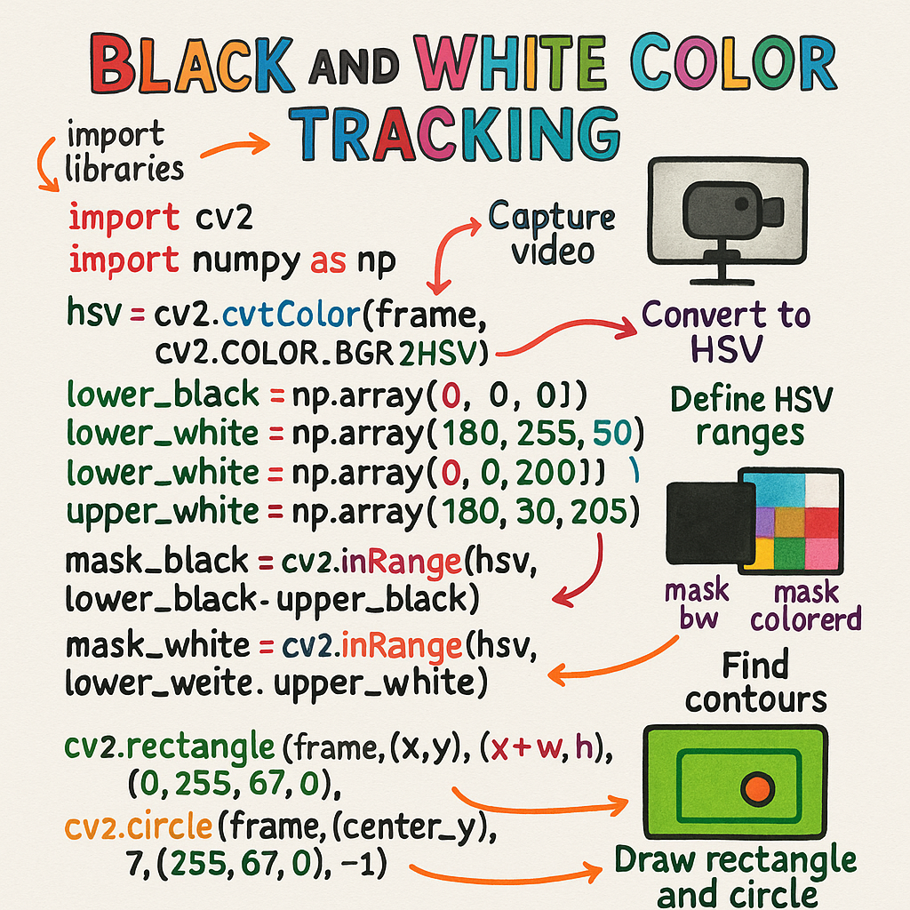

# BALL_DETECTOR Robot
 This project implements is an  obstacle-detector robot using computer vision to detect balls, with real-time debug visualization and Arduino-based motor control. The robot processes camera input to detect obstacles.

## Project Overview
 The robot uses OpenCV to process video frames, detecting obstacle (main path)  . A calibration system allows to detect obstacles. Commands are sent to an Arduino to control motors based on navigation decisions.

## Setup Instructions
# 1. Clone the Repository
Clone or download the project to your local machine:
```bash
git clone https://github.com/anas-1-a/OBSTACLE_DETECTION
cd OBSTACLE_DETECTION
```
# 2. Create a Virtual Environment
Create and activate a virtual environment to isolate dependencies:
### Windows
``` bash
python -m venv venv
venv\Scripts\activate
```
You should see (venv) in your terminal prompt.
# 3. Install Dependencies
Install the required Python packages:
```bash
pip install opencv-python pyserial numpy
```
opencv-python: For image processing and visualization.
pyserial: For Arduino communication.
numpy: For array operations.

# Running the Project
## 1. Start the Program
Run the main script from the virtual environment:
```bash 
python main.py
```
# HOW IT WORKS :
## Main.py: 



### THIS HOW CODE MAIN.PY WORK :

## Arduino.ino:


### THIS HOW CODE ARDUINO.INO WORK :


